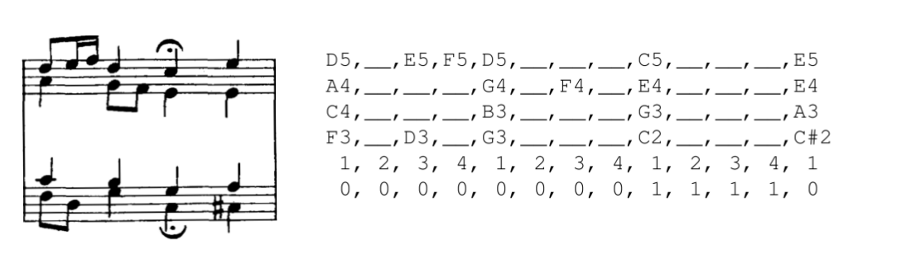
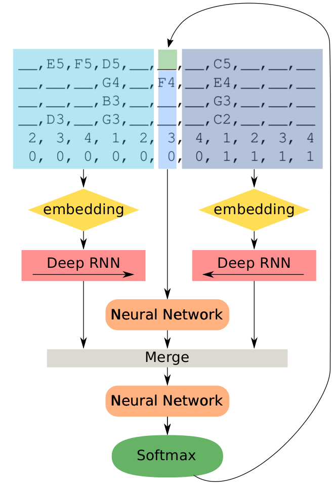
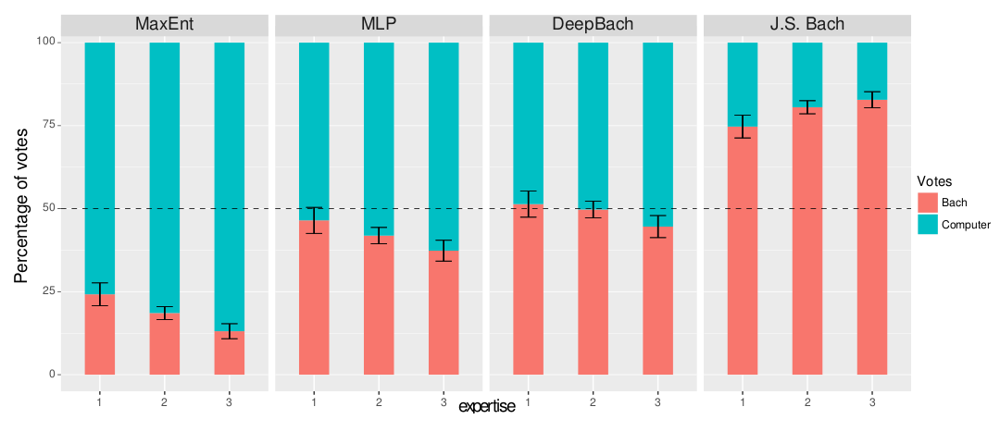

```{r, include=FALSE, message=FALSE, echo=FALSE, warning=FALSE}
library(tidyverse)
library(magick)
knitr::opts_chunk$set(echo=FALSE, warning = FALSE, message=FALSE)
```

## Contexto

- Estudo sobre corais do Bach
- Bach tem qu 389 peças de corais
    - um coral é composto por 4 vozes: soprano, contralto, tenor, baixo
    - composições contrapontísticas
    - https://www.youtube.com/watch?v=HPN88O-LX70

```{r out.width='30%', fig.align='center'}
knitr::include_graphics('bach.jpg')
```


## Questões norteadoras

- Será possível imitar o estilo de Bach e gerar músicas automaticamente?
- É possível completar pedaços de música com o estilo do Bach?
- Como fazer para modelar esses dados?

# Análise de dados na música em 3 passos

## Análise de dados na música em 3 passos

**Leitura**: extrair dados estruturados dos áudios.
    - *Music Information Retrieval* - MRI

```{r eval=FALSE}
library(magick)
im1 <- image_read('arrow-bold-right-ios-7-symbol_318-35504.jpg') %>% 
  image_scale('100x100') %>% 
  image_border('white', 'x50')
im3 <- image_read('Tutu-mp3-wav-converter.jpg') %>% 
  image_scale('x130') %>% 
  image_border('white', 'x50')
im2 <- image_read('midi.jpg') %>% 
  image_scale('x180')
image_join(im3, im1, im2) %>% 
  image_append() %>% 
  image_write('download.png')
```


```{r, out.width='80%', fig.align='center'}
knitr::include_graphics('download.png')
```

## Análise de dados na música em 3 passos

**Composição**: Criar ou completar músicas automaticamente
    - Harmonização

```{r}
im1 <- image_read('arrow-bold-right-ios-7-symbol_318-35504.jpg') %>% 
  image_scale('100x100') %>% 
  image_border('white', 'x50')
im2 <- image_read('midi.jpg') %>% 
  image_scale('x180') %>% 
  image_border('white', 'x50')
im3 <- image_read('midi.jpg') %>% 
  image_scale('x180') %>% 
  image_charcoal()
image_join(im3, im1, im2) %>% 
  image_append() %>% 
  image_write('generate.png')
```

```{r, out.width='80%', fig.align='center'}
knitr::include_graphics('generate.png')
```

## Análise de dados na música em 3 passos

**Edição**: Adicionar efeitos na música para produção

```{r}
im1 <- image_read('arrow-bold-right-ios-7-symbol_318-35504.jpg') %>% 
  image_scale('100x100') %>% 
  image_border('white', 'x50')
im2 <- image_read('daw.jpg') %>% 
  image_scale('x180') %>% 
  image_border('white', 'x50')
im3 <- image_read('midi.jpg') %>% 
  image_scale('x180')
image_join(im3, im1, im2) %>% 
  image_append() %>% 
  image_write('transform.png')
```


```{r, out.width='80%', fig.align='center'}
knitr::include_graphics('transform.png')
```

## Interesse

Parte 2: composição

Queremos

- Compor uma música nova a partir de um modelo treinado com Bach
- Completar uma melodia existente com o estilo do Bach

# Notação

## Restrições

- Discretização: 
    - intervalo mínimo: semicolcheia = 1/4 de batida
    - tempo único
- Corais
    - Apenas 1 melodia por voz
    - Sempre 4 vozes
- Notas

$$
\mathcal V_i = \{\mathcal V_i^t\}_t, t\in \{1,\dots,T\}, i=\{1,2,3,4\}
$$

- $T$: duração da música
- $i$: índice da voz

## Notas

- quais notas? 

$$
\mathcal V_i^t \in \{\_\_, C_1, C\#_1, D1, D\#_1, ... B_1, C_2, C\#_2, ...\}
$$

- cada voz tem um intervalo de notas possíveis (amplitude vocal)

## Metadados

$$
\mathcal M = (\mathcal S, \mathcal F, \mathcal R)
$$

- $\mathcal S^t\in \{1,2,3,4\}$: posição da batida
- $\mathcal F^t\in \{\text{sim},\text{não}\}$: fermata
- $\mathcal R^t\in \{-7, -6, \dots, 0, 1, \dots, 7\}$: guarda o tom, para anotar modulações corretamente e trabalhar com enarmonias.


## Dados

Para cada música, nossos dados de entrada são a tupla

$$
(\mathcal V, \mathcal M),
$$

em que $\mathcal V = (\mathcal V_i),i\in 1,2,3,4$.

```{r}
image_read('data.png') %>% 
  image_crop("1100x320+670+340") %>% 
  image_write('data_ok.png')
```

```{r, out.width='80%', fig.align='center'}

```

## Modelo

Construímos um modelo que nos dê

$$
\left\{p_i(\mathcal V_i^t | \mathcal V_{\setminus \{i,t\}}, \mathcal M, \theta_{i})\right\}, i \in 1,2,3,4; t\in 1,\dots, T
$$

- $\mathcal V_{\setminus \{i,t\}}$ são todas as notas na vizinhança de $\mathcal V_i^t$, excluindo ela própria
- $\theta_{i}$ vetor de parâmetros do modelo.
- Na prática, acabamos usando 

$$
\tilde {\mathcal V}_{\setminus\{i,t\}} = \{\mathcal V_j^s, j \neq i, s\in\{t-\Delta t, \dots, t-1, t+1, \dots, t + \Delta t\}\}
$$

- Nesse trabalho, foi usado $\Delta t = 16$.

## Otimização

Queremos obter $\theta_{i}$ de tal forma que

$$
\hat \theta_i = \arg \max_{\theta_i}  \sum_t \log p_i(\mathcal V_i^t | \mathcal V_{\setminus \{i,t\}}, \mathcal M, \theta_{i}), \;\;\;i=1,2,3,4
$$

- Para realizar essa otimização, definimos uma arquitetura para o vetor de parâmetros $\theta_{i}$, utilizando uma rede neural.
- **Vantagens**:
    - Não linearidade considerada de forma flexível
    - Otimização realizada por uma simples descida de gradiente, graças ao *backpropagation*

## Arquitetura

```{r}
image_read('architecture.png') %>% 
  image_crop("660x960+920+090") %>% 
  image_write('architecture_ok.png')
```

```{r, out.width='50%', fig.align='center'}

```

# Um pouco de NN, RNN e LSTM

# Algoritmo generativo (composição)

## Algoritmo pseudo-gibbs

- Basicamente, o que fazemos é
    a. Escolher uma voz $i$ e um ponto no tempo $t$, aleatoriamente: $\mathcal V_i^t$
    a. Preencher a vizinhança $\tilde {\mathcal V}_{\setminus\{i,t\}}$ com dados do input / iterações anteriores, ou aleatoriamente.
    a. Gerar uma nota com probabilidade $\hat p_i$.

Fazemos isso por um número de iterações $M$ definido pelo usuário.

- Não é um Gibbs pois o algoritmo não converge para $p(\mathcal V)$.
- No entanto, o algoritmo chega a uma distribuição estacionária, segundo os autores.

# Resultados

## Teste com humanos

- 1272 pessoas
    - 261 ouvem música clássica raramente
    - 646 adoram música ou praticam música como hobby
    - 365 são estudantes ou profissionais na música
- Comparação de 4 modelos:
    - **MaxEnt**: Rede neural com 1 layer de 1 unidade, sem ativação.
    - **Multilayer Perceptron**: 1 hidden layer com 500 unidades, ativação ReLU
    - **DeepBach**: 200 unidades em cada LSTM, 200 unidades em cada Perceptron, ativação ReLU e dropouts.
    - **Bach**: benchmark

## Condução do teste

- Cada pessoa foi submetida a extratos de músicas geradas por algum dos algoritmos (incluindo Bach), chutando se sera uma composição do Bach ou não.
- Os extratos de músicas foram gerados com uma das vozes (soprano) da base de validação, para i) permitir comparação e ii) evitar erros de overfitting.

## Resultados

**Vermelho**: % de pessoas que chutaram "Bach" nas composições

```{r}
image_read('results.png') %>% 
  image_crop("1080x480+700+330") %>% 
  image_write('results_ok.png')
```

```{r, out.width='100%', fig.align='center'}

```

# Comentários finais

## Conclusões

- É possível fazer composições automáticas do Bach que não ficam horríveis.
- A teoria é razoavelmente simples, a implementação muito simples.
- Trata-se de uma área com muitos avanços recentes e muitas oportunidades.

## Futuro (julio)

- Portar esse modelo completamente para o R.
- Fazer um post no blog da curso-r.com sobre esse assunto.
- Implementar diferentes arquiteturas e parametrizações.
- Estudar outros *corpus* para implementar o modelo.

## Bibliografia

- https://github.com/Ghadjeres/DeepBach
- https://github.com/felipessalvatore/RNNpresentation
- http://colah.github.io/posts/2015-08-Understanding-LSTMs/


